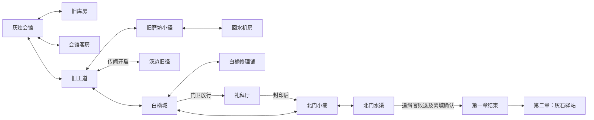

# 第一章稳定运行审计

起点 `5e289bc90d3e79a5e7d44236bb229a43b05cce87`，运行仍为恢复后的 V30。本审计不采用未验收的旧重构。完整数据与哈希见 `AUDIT.json`，可通过 `node docs/ch1-pilot-r2/audit.mjs` 重现。新的真实基线及浏览器证据见 `baseline/RESULT.json`。尚未冻结开发稿、修改运行内容或生成新美术。

## 范围冲突

本次会话 prompt 要求全面第一章地图重设计、逐事件状态与可玩的非致死对抗；刚同步的远端 0.3 稿要求保留拓扑、任务、18 行刺杀对白与原章界，交手仅作演出。两者并非实现细节差异。已向用户询问采用范围；当前只保存两方案共同需要的基线与审计，未把 0.3 或旧 0.2 自动置为 DEV_FROZEN。

第一章和第二章 0.3 稿均已全文读取。第二章保持 SCRIPT_READY，本轮不改其运行代码。后续须先记录采用版本、实施决定和章界，再按稿实现；不能混用旧全面重构与新局部稿。

## 主线与地图

从实际注册地图的 hall 出发，遍历所有门并在 end 章节转换处停止，独立得到 12 图；结果与 CHAPTER_ONE_MAPS_V30 一致。地图列表不是历史“11 图表现范围”。post 和 inn 在当前运行中属于第二章，不在此遍历内。

图中是空间连通关系，是否可通行仍以阶段/锁为准：刺杀后礼拜厅封锁，追缉官活着时水渠出口锁住，章节结束后不可回城。完整门坐标、锁名称、原因文本及 7 组阶段探针保存在 JSON。探针用临时 RPG 对象设定阶段/标记，不代表实际通关，也未模拟每条隐藏路线的发现。

| 地图 | 功能与必须保护的内容 |
| --- | --- |
| hall 灰烛会馆 | 奥伦清鼠交付、薇蕾娜契约/行前/道别、鲁恩、技能笔记；连接库房/客房/王道 |
| warehouse 旧库房 | 六鼠与裂缝共同完成主任务；油、技能书与破坏物 |
| guestroom 会馆客房 | 日记、洗漱、休息与同伴对话 |
| road 旧王道 | 信使、失信、三草、狼群；通往城镇、传闻旧径、磨坊 |
| town 白榆城 | 圣女照护过场、门卫、药师/母亲/老妇/朵莉、井与告示 |
| chapel 礼拜厅 | 卡德兰、艾莉娅与刺杀封术演出；南正门、东侧门、礼桌、讲坛 |
| alley 北门小巷 | 逃亡路线；与城镇连接、侧门回返锁、通水渠 |
| canal 北门水渠 | 守卫、追缉官战斗、离城确认、可选回城道别 |
| grove 溪边旧径 | 传闻解锁、石缝归还支线、草药与野生敌人 |
| millpath 旧磨坊小径 | 铜圈、旧练习台、损坏门与水轮、探察标记、通机房 |
| echo 回水机房 | 兽群、阀门/晶体/机芯、笔记、机关奖励的领取状态 |
| workshop 白榆修理铺 | 洛缇、铜圈/机芯交付、重置台、票据与工具架 |

主线原顺序：intro → 接清鼠 → 六鼠/裂缝 → ratDone/aside → contract → 城中 saintBrief → watch → assassination → canalStart → 追缉官 → chapterEnd → 第二章 ch2Arrival。原章节 phase 为 0→1→2→3→4→5；旧核心 switch 的 ending 不是最终章界，chapterApply 已在此前拦截 end 并转 post。

支线保护集合为 oil、letter、herbs、lantern、copper、echo、farewell。尤其草药去向、机关选择/领奖、离城前未完成支线与道别，不能仅以主线 phase 重置。现有任务描述、奖励和物件 ID 已落盘。

## 叙事、演出与存档

- 最终 DIALOGUES 在 core 的多层安装后读取，不能只改 data-v14。四段主要对白哈希与 0.3 记录一致：contract 20 行、assassination 18 行、canalStart 9 行、chapterEnd 14 行。
- chapel phase 2 首次进入先设置 flags.assassination，再 beginScene；当时 phase 仍为 2。这是现有语义，不表示救治、封印或逃脱已完成。finishScene 的 then=assassinate 才推进 phase 3、完成契约、启动逃脱并发 65 XP。
- StoryFlow 保存 pending.line/phase/closing；Cinematic 有逐句动作、outro 及实际人物提交。演出最后要正确移交控制与原 then，恢复时不能重复发奖励。
- finishScene 会记录知识；回看不能走这条带状态效果的路径。pending.lines 还受 dialogue-save-migration-v26 的文本签名与演员顺序约束；beforeDeparture 和 memory 中的嵌套档也在迁移范围。
- 当前礼拜厅契约：正门 (780,960)、东侧门 (1420,640)、礼桌 (1080,525)、桌碰撞 [980,470,205,55]、讲坛 (1095,255)；刺杀初始 hero (800,850)、prelate (1230,530)、saint (1295,575)，原收束 hero (1390,640)、saint (1355,670)。新 CG 必须依据采用后的同一平面方案构图。
- 固定刺杀短刃属于临时剧情绘制道具，不能更改实际职业/装备。当前礼拜厅为 safe；若采用本次完整 prompt 的剧情战斗，需要显式事件授权和非致死屏障目标，不能靠常规敌人生命条冒充。

第二章保护依据：保存了全量最终对白与地图哈希，后续需对照未授权改动。原章2已有运行内容与新章2稿的追加策划不同；只记录新稿，不将旧场景回放称作新内容实装。特别是未来 darkExile 改稿与当前 exile-was-unplanned 知识项存在差异，本轮不得顺带修改。

## 当前证据与边界

baseline 命令成功退出，源码检查期间未变；只读审计成功。JSON 保存 334 个运行文件字节/哈希、实际 12 图及连通推导、29 段场景和 7 组门禁阶段探针。没有读取或改写用户个人存档。

本阶段没有验证新地图、新演出或新战斗；没有新资产完成度、三维地图质量或连续新章通关结论。旧回滚验收只能作为稳定对照，不能当本轮开发结果。
